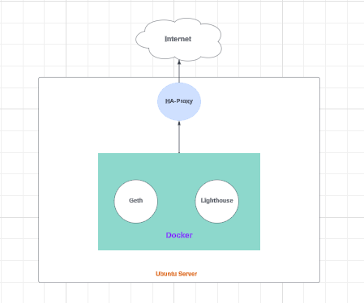
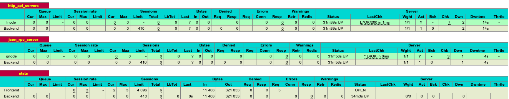

Application Design
=========



Role Name
=========

This role is designed to set up Geth and Lighthouse clients within Docker containers, along with additional wallets. Leveraging HAProxy, all RPC requests will be intelligently routed to both Ethereum clients.

Requirements
------------

This role is specifically developed for Linux distributions like Debian and Ubuntu, It is not compatible with other operating systems.

Role Variables
--------------

This role incorporates variables defined in both defaults/main.yml and vars/testnet.yml.

How to Use this role
==============
To execute the Ansible playbook on the target Linux box, follow these steps:

1.	Login to the Linux Box:
SSH into the Linux box where you want to execute the Ansible playbook.

2.	Switch to Root:
Switch to the root user using the following command:
```
sudo su -
```

3.	Install Ansible and Git:
Install Ansible and Git using the apt package manager:
```
sudo apt update
```
```
sudo apt install ansible git -y
```

4.	Clone Repository:
Clone the repository locally:
```
git clone https://github.com/draju1980/eth-HA.git
```

5.	Change Directory:
Change to the eth-HA directory:
```
cd eth-HA
```

6.	Run Ansible Playbook:
Run the Ansible playbook using the inventory file:

```
ansible-playbook -i inventory.ini tasks/main.yml
```

ETH node operations using ethHA {start|stop|restart|reset}
--------------
Using ethHA we can stop, start restart or reset ethereum nodes.

To restart ethereum nodes use below command.
```
:~# ethHA restart
Restarting all Docker containers...
geth
lighthouse
```

To stop the ethereum nodes use below command.
```
:~# ethHA stop
Stopping all Docker containers...
geth
lighthouse
```

To start ethereum nodes use below command.
```
:~# ethHA start
Starting all Docker containers...
geth
lighthouse
```

To reset ethereum nodes use below command, reset will wipe all the chain data.
```
:~# ethHA reset
Stop all Docker containers...
geth
lighthouse
Removing all containers data......
Starting all Docker containers...
geth
lighthouse
```

RPC and REST API request to ethereum nodes
--------------
Given that Geth nodes support RPC requests and Lighthouse nodes support REST API requests, you can leverage a load balancer to route and respond to both types of requests using the same endpoint. Here are a few examples:


Sending an RPC request to a Geth node:
```
curl -X POST -H "Content-Type: application/json" --data '{"jsonrpc":"2.0","method":"eth_blockNumber","params":[],"id":1}' http://helloworld.com
```

Sending a REST API request to a Lighthouse node:
```
curl -X GET "http://helloworld.com/lighthouse/peers" -H  "accept: application/json"
```

Another example of sending an RPC request to a Geth node:
```
curl -X POST -H "Content-Type: application/json" --data '{"jsonrpc":"2.0","method":"eth_getBalance","params":["0x407d73d8a49eeb85d32cf465507dd71d507100c1","latest"],"id":1}' http://helloworld.com
```

Sending a REST API request to a Lighthouse node:
```
curl -X GET "http://helloworld.com/lighthouse/health" -H  "accept: application/json"
```

To view backend RPC or REST API stats via the HAProxy UI
--------------
Access the HAProxy stats UI via port 8080 using an auto-generated password provided at the completion of the playbook. Alternatively, you can obtain the login credentials from the HAProxy configuration file located at /etc/haproxy/haproxy.cfg.


